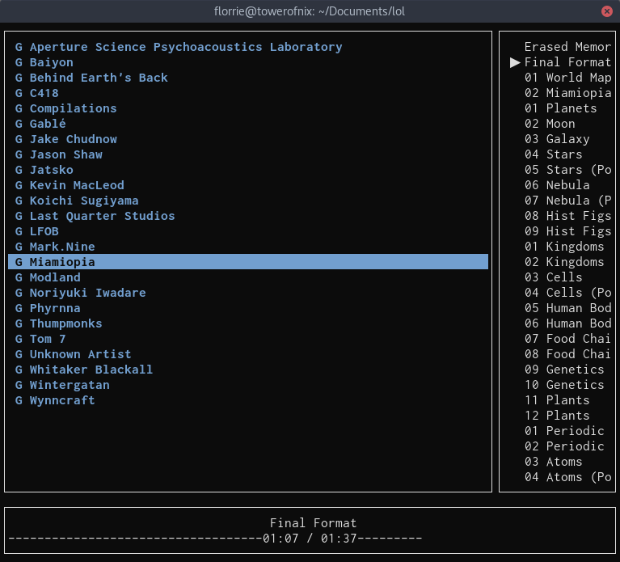

## keybindings

* <kbd><kbd>Ctrl</kbd>+<kbd>C</kbd></kbd> - exit
* <kbd>Up</kbd> and <kbd>Down</kbd> - select previous or next item in a listing
* <kbd>PageUp</kbd> and <kbd>PageDown</kbd> - navigate up or down a visible-page-length of a listing (the usual meaning of page-up/down!)
* <kbd>Tab</kbd> and <kbd><kbd>Shift</kbd>+<kbd>Tab</kbd></kbd> - switch between UI elements
* <kbd>1</kbd> - focus the main track/group listing
* <kbd>2</kbd> - focus the queue listing
* <kbd>Enter</kbd> - play the selected track
* <kbd><kbd>Shift</kbd>+<kbd>Up</kbd></kbd> - play previous track
* <kbd><kbd>Shift</kbd>+<kbd>Down</kbd></kbd> - play next track
* <kbd>Space</kbd>, <kbd>p</kbd>, or <kbd>k</kbd> - toggle pause
* <kbd>Right</kbd> or <kbd>l</kbd> - seek ahead
* <kbd>Left</kbd> or <kbd>j</kbd> - seek back
* <kbd>s</kbd> - shuffle the queue
* **In the main listing:**
  * <kbd>Enter</kbd> - if the selected item is a group, enter it; otherwise play it
  * <kbd>Backspace</kbd> - leave the current group (if in one)
  * <kbd>q</kbd> - queue the selected track to play after any other items in the queue (usually after the current track)
  * <kbd>d</kbd> - download the selected track (but don't play it)
* **In path displays:** (Path displays are the things that show below the main and queue listings. They show the path of groups to the selected item in the listing.)
  * <kbd>Enter</kbd> or <kbd>Space</kbd> - view the selected item in the main listing
  * <kbd>Left</kbd> and <kbd>Right</kbd> - navigate the path display
